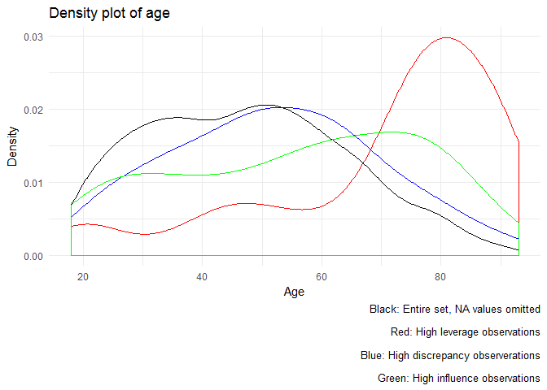

# Problem Set #3: Regression Diagnostics, Interaction Terms, and Missing Data
Soo Wan Kim  
May 11, 2017  


## Regression diagnostics


```r
biden1 <- biden %>%
  na.omit()

lr_mod1 <- lm(biden ~ age + female + educ, data = biden1)
tidy(lr_mod1)
```

```
##          term    estimate  std.error statistic      p.value
## 1 (Intercept) 68.62101396 3.59600465 19.082571 4.337464e-74
## 2         age  0.04187919 0.03248579  1.289154 1.975099e-01
## 3      female  6.19606946 1.09669702  5.649755 1.863612e-08
## 4        educ -0.88871263 0.22469183 -3.955251 7.941295e-05
```

### Part 1
**Test the model to identify any unusual and/or influential observations. Identify how you would treat these observations moving forward with this research. Note you do not actually have to estimate a new model, just explain what you would do. This could include things like dropping observations, respecifying the model, or collecting additional variables to control for this influential effect.**


```r
# add key statistics
bid1_augment <- biden1 %>%
  mutate(hat = hatvalues(lr_mod1),
         student = rstudent(lr_mod1),
         cooksd = cooks.distance(lr_mod1))

# draw bubble plot
ggplot(bid1_augment, aes(hat, student)) +
  geom_hline(yintercept = 0, linetype = 2) +
  geom_point(aes(size = cooksd), shape = 1) +
  geom_text(data = bid1_augment %>%
              arrange(-cooksd) %>%
              slice(1:10),
            aes(label = biden)) +
  scale_size_continuous(range = c(1, 20)) +
  labs(x = "Leverage",
       y = "Studentized residual") +
  theme(legend.position = "none")
```

<!-- -->

The bubble plot shows many observations with high discrepancy and some observations with high leverage as well as high discrepancy.


```r
bid1_hat <- bid1_augment %>%
  filter(hat > 2 * mean(hat))

bid1_stud <- bid1_augment %>%
  filter(abs(student) > 2)

bid1_inf <- bid1_augment %>%
  filter(cooksd > 4 / (nrow(.) - (length(coef(lr_mod1)) - 1) - 1))
```

Using the hat-values test, I find 74 observations with unusually high leverage. Using the studentized residuals test, I find 82 highly discrepant observations. Using the influence test, I find 90 highly influential observations. Looking through the observations, I do not find any that are obviously miscoded. On the other hand, the high discrepancy observations have unusually low values for `biden`, whereas the high leverage observations have unusually high values for `age` and unusually low values for `educ`. 


```r
#Biden thermometer
ggplot(biden1, aes(biden)) + 
  geom_density() + 
  geom_density(data = bid1_hat, mapping = aes(biden), color = "red") + 
  geom_density(data = bid1_stud, mapping = aes(biden), color = "blue") + 
  geom_density(data = bid1_inf, mapping = aes(biden), color = "green") + 
  labs(title = "Density plot of Biden feeling thermometer measures",
       x = "Biden feeling thermometer reading",
       y = "Density",
       caption = "Black: Entire set, NA values omitted\n
       Red: High leverage observations\n
       Blue: High discrepancy observerations\n
       Green: High influence observations")
```

<!-- -->

```r
#Age
ggplot(biden1, aes(age)) + 
  geom_density() + 
  geom_density(data = bid1_hat, mapping = aes(age), color = "red") + 
  geom_density(data = bid1_stud, mapping = aes(age), color = "blue") + 
  geom_density(data = bid1_inf, mapping = aes(age), color = "green") + 
  labs(title = "Density plot of age",
       x = "Age",
       y = "Density",
       caption = "Black: Entire set, NA values omitted\n
       Red: High leverage observations\n
       Blue: High discrepancy observerations\n
       Green: High influence observations")
```

<!-- -->

```r
#Gender
ggplot(biden1, aes(female)) + 
  geom_density() + 
  geom_density(data = bid1_hat, mapping = aes(female), color = "red") + 
  geom_density(data = bid1_stud, mapping = aes(female), color = "blue") + 
  geom_density(data = bid1_inf, mapping = aes(female), color = "green") + 
  labs(title = "Density plot of gender",
       x = "Gender (0 = Male, 1 = Female)",
       y = "Frequency",
       caption = "Black: Entire set, NA values omitted\n
       Red: High leverage observations\n
       Blue: High discrepancy observerations\n
       Green: High influence observations")
```

<!-- -->

```r
#Education
ggplot(biden1, aes(educ)) + 
  geom_density() + 
  geom_density(data = bid1_hat, mapping = aes(educ), color = "red") + 
  geom_density(data = bid1_stud, mapping = aes(educ), color = "blue") + 
  geom_density(data = bid1_inf, mapping = aes(educ), color = "green") + 
  labs(title = "Density plot of education level",
       x = "Years of schooling",
       y = "Density",
       caption = "Black: Entire set, NA values omitted\n
       Red: High leverage observations\n
       Blue: High discrepancy observerations\n
       Green: High influence observations")
```

<!-- -->


Since the only weird thing about these observations are the extreme values and there is nothing to suggest that these are caused by measurement error, miscoding, or anything else that invalidates the observations, I would keep them in the dataset. Instead of dropping the unusual observations I would try to mitigate error by respecifying the model. Specifically, I would add party identification as another independent variable because I suspect party identification is an important determinant of attitudes toward Biden. 

### Part 2
**Test for non-normally distributed errors. If they are not normally distributed, propose how to correct for them.**


```r
car::qqPlot(lr_mod1)
```

<!-- -->

```r
augment(lr_mod1, biden1) %>%
  mutate(.student = rstudent(lr_mod1)) %>%
  ggplot(aes(.student)) +
  geom_density(adjust = .5) +
  labs(x = "Studentized residuals",
       y = "Estimated density")
```

<!-- -->

The quantile comparison plot and the density plot of studentized residuals indicate that the errors are not normally distributed. To correct for this, I would take log, power, or other transformations of variables to make their values more normally distributed.

### Part 3 
**Test for heteroscedasticity in the model. If present, explain what impact this could have on inference.**


```r
bptest(lr_mod1)
```

```
## 
## 	studentized Breusch-Pagan test
## 
## data:  lr_mod1
## BP = 22.559, df = 3, p-value = 4.989e-05
```

The result of the Breusch-Pagan test indicates that heteroscedasticity is present.


```r
biden1 %>%
  add_predictions(lr_mod1) %>%
  add_residuals(lr_mod1) %>%
  ggplot(aes(pred, resid)) +
  geom_point(alpha = .2) +
  geom_hline(yintercept = 0, linetype = 2) +
  geom_quantile(method = "rqss", lambda = 5, quantiles = c(.05, .95)) +
  labs(title = "Variance of error terms",
       x = "Predicted values",
       y = "Residuals")
```

<!-- -->

From graphing the residuals against predicted values, it looks like residuals become more negative as predicted values increase. This suggests the model systematically overestimates or underestimates Biden warmth based on combinations of independent variable values. It also suggests the model overlooks some important factor that affects Biden thermometer ratings.

### Part 4
**Test for multicollinearity. If present, propose if/how to solve the problem.**


```r
vif(lr_mod1)
```

```
##      age   female     educ 
## 1.013369 1.001676 1.012275
```

The VIF statistic is less than 10 for all variables, which indicates multicollinearity is not present. 

### Interaction terms


```r
biden2 <- biden %>%
  na.omit()

lr_mod2 <- lm(biden ~ age*educ, data = biden2)
tidy(lr_mod2)
```

```
##          term   estimate  std.error statistic      p.value
## 1 (Intercept) 38.3735103 9.56356681  4.012468 6.254443e-05
## 2         age  0.6718750 0.17049152  3.940812 8.430505e-05
## 3        educ  1.6574253 0.71399213  2.321350 2.037897e-02
## 4    age:educ -0.0480341 0.01290186 -3.723037 2.028851e-04
```

#### Part 1
**Evaluate the marginal effect of age on Joe Biden thermometer rating, conditional on education. Consider the magnitude and direction of the marginal effect, as well as its statistical significance.**


```r
# function to get point estimates and standard errors
# model - lm object
# mod_var - name of moderating variable in the interaction
instant_effect <- function(model, mod_var){
  # get interaction term name
  int.name <- names(model$coefficients)[[which(str_detect(names(model$coefficients), ":"))]]
  
  marg_var <- str_split(int.name, ":")[[1]][[which(str_split(int.name, ":")[[1]] != mod_var)]]
  
  # store coefficients and covariance matrix
  beta.hat <- coef(model)
  cov <- vcov(model)
  
  # possible set of values for mod_var
  if(class(model)[[1]] == "lm"){
    z <- seq(min(model$model[[mod_var]]), max(model$model[[mod_var]]))
  } else {
    z <- seq(min(model$data[[mod_var]]), max(model$data[[mod_var]]))
  }
  
  # calculate instantaneous effect
  dy.dx <- beta.hat[[marg_var]] + beta.hat[[int.name]] * z
  
  # calculate standard errors for instantaeous effect
  se.dy.dx <- sqrt(cov[marg_var, marg_var] +
                     z^2 * cov[int.name, int.name] +
                     2 * z * cov[marg_var, int.name])
  
  # combine into data frame
  data_frame(z = z,
             dy.dx = dy.dx,
             se = se.dy.dx)
}

instant_effect(lr_mod2, "educ") %>%
  ggplot(aes(z, dy.dx,
             ymin = dy.dx - 1.96 * se,
             ymax = dy.dx + 1.96 * se)) +
  geom_pointrange() +
  geom_hline(yintercept = 0, linetype = 2) +
  labs(title = "Marginal effect of age on Joe Biden thermometer rating",
       subtitle = "By education level",
       x = "Years of schooling",
       y = "Estimated marginal effect")
```

<!-- -->

Increasing age increases the Biden thermometer rating for education levels between 0 and 13 years of education, and decreases it for education levels 15 and above. The effects are statistically significant for education levels between 0 and 12 years and between 16 and 17 years; that is, the confidence intervals exclude 0 for those ranges. Looking only at the statistically significant marginal effects, a one-year increase in age increases the Biden rating by about 0.1 to 0.7 points for education levels between 0 and 12 years, and decreases the Biden rating by about 0.1 to 0.2 points for education levels between 16 and 17 years.

#### Part 2
**Evaluate the marginal effect of education on Joe Biden thermometer rating, conditional on age. Consider the magnitude and direction of the marginal effect, as well as its statistical significance.**


```r
instant_effect(lr_mod2, "age") %>%
  ggplot(aes(z, dy.dx,
             ymin = dy.dx - 1.96 * se,
             ymax = dy.dx + 1.96 * se)) +
  geom_pointrange() +
  geom_hline(yintercept = 0, linetype = 2) +
  labs(title = "Marginal effect of education on Joe Biden thermometer rating",
       subtitle = "By age level",
       x = "Age",
       y = "Estimated marginal effect")
```

<!-- -->

Increasing education levels increases the Biden thermometer rating for ages approximately 18 to 30, and decreases it for all other ages. The effects are statistically significant for ages approximately 45 and up. Looking only at the statistically significant marginal effects, a one-year increase in education level decreases the Biden rating by between 0.5 and 3 points. 

### Missing data
**This time, use multiple imputation to account for the missingness in the data. Consider the multivariate normality assumption and transform any variables as you see fit for the imputation stage. Calculate appropriate estimates of the parameters and the standard errors and explain how the results differ from the original, non-imputed model.**


```r
biden_lite <- select(biden, -dem, -rep)

ggpairs(biden_lite)
```

<!-- -->

The continuous variables `biden`, `age`, and `educ` are clearly not normally distributed. However, applying simple transformations such as taking the log or square root did not make much difference except in the case of `age`. Thus, I apply multiple imputation with a log transformation applied only to `age`.


```r
biden_lite.out <- amelia(biden_lite, m = 5,
                      logs = c("age"))
```

```
## -- Imputation 1 --
## 
##   1  2  3  4  5  6
## 
## -- Imputation 2 --
## 
##   1  2  3  4  5
## 
## -- Imputation 3 --
## 
##   1  2  3  4  5
## 
## -- Imputation 4 --
## 
##   1  2  3  4  5
## 
## -- Imputation 5 --
## 
##   1  2  3  4
```

```r
models_trans_imp <- data_frame(data = biden_lite.out$imputations) %>%
  mutate(model = map(data, ~ lm(biden ~ log(age) + female + educ,
                                data = .x)),
         coef = map(model, tidy)) %>%
  unnest(coef, .id = "id")

lr_mod3 <- lm(biden ~ log(age) + female + educ,
                 data = biden)

mi.meld.plus <- function(df_tidy){
  # transform data into appropriate matrix shape
  coef.out <- df_tidy %>%
    select(id:estimate) %>%
    spread(term, estimate) %>%
    select(-id)
  
  se.out <- df_tidy %>%
    select(id, term, std.error) %>%
    spread(term, std.error) %>%
    select(-id)
  
  combined.results <- mi.meld(q = coef.out, se = se.out)
  
  data_frame(term = colnames(combined.results$q.mi),
             estimate.mi = combined.results$q.mi[1, ],
             std.error.mi = combined.results$se.mi[1, ])
}

tidy(lr_mod3) %>%
  left_join(mi.meld.plus(models_trans_imp)) %>%
  select(-statistic, -p.value)
```

```
##          term   estimate std.error estimate.mi std.error.mi
## 1 (Intercept) 62.2118694 6.3714523  58.6857360    6.7007169
## 2    log(age)  1.9846331 1.4203420   2.5956361    1.4016691
## 3      female  6.0206180 1.0898466   5.9818591    1.0218418
## 4        educ -0.8240799 0.2214316  -0.7425816    0.2271171
```

vs. the model in **Regression diagnostics**:

```r
tidy(lr_mod1)
```

```
##          term    estimate  std.error statistic      p.value
## 1 (Intercept) 68.62101396 3.59600465 19.082571 4.337464e-74
## 2         age  0.04187919 0.03248579  1.289154 1.975099e-01
## 3      female  6.19606946 1.09669702  5.649755 1.863612e-08
## 4        educ -0.88871263 0.22469183 -3.955251 7.941295e-05
```

The estimates from the imputed model are fairly similar to non-imputed models. Standard errors are slightly smaller for some variables in the imputed model compared to the non-imputed model without list-wise deletion of missing observations. Standard errors are actually smaller overall for the non-imputed model with list-wise deletion, showing that list-wise deletion is not necessarily a bad strategy compared to multiple imputation.
